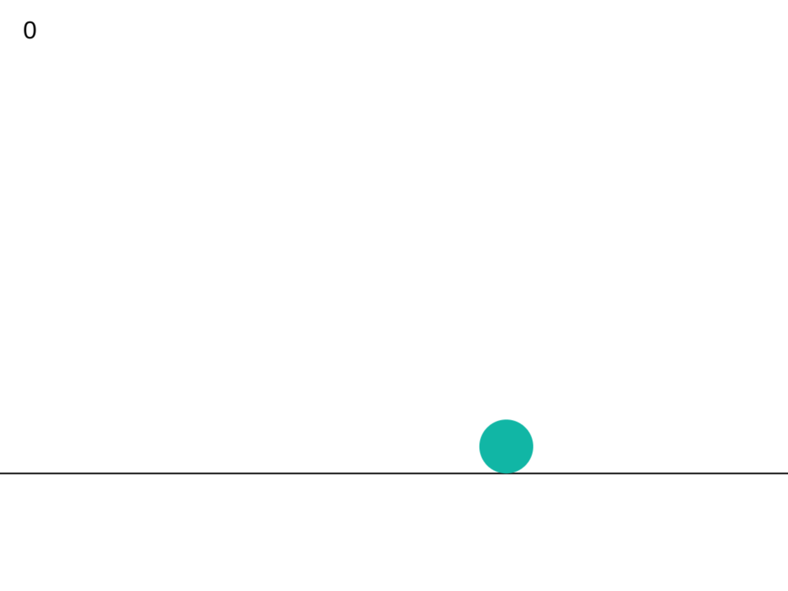

# Wandermore

**Wandermore** is a 2D physics playground written in Ink, compiled with September.

I've been hacking on it on and off, adding features to it when I feel like it. Right now, it supports:

- Momentum-based physics
- Gravity
- Limited collision detection (with ground, walls)

Use `SPACE` to jump and the arrow keys to move in the x-direction, and change mass.

